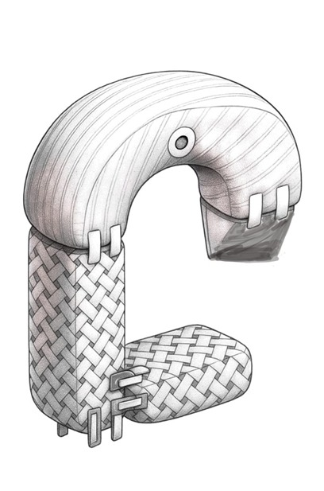
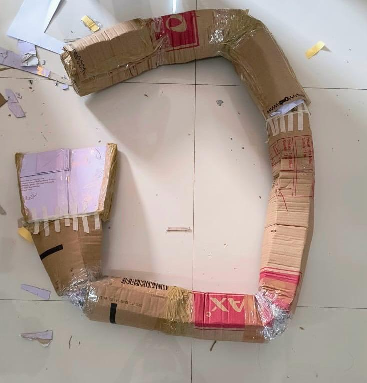

# Modular Maternity Support Pillow

A patent-backed ergonomic maternity support system designed to improve comfort during pregnancy and provide adaptable support during postnatal recovery.

## Overview

Pregnancy introduces profound physiological and biomechanical changes that alter posture, shift the body's center of gravity, and place increased strain on the spine, abdomen, and lower back. As the pregnancy progresses, these changes often lead to sleep disturbances, muscular discomfort, and difficulty maintaining ergonomic resting positions.

Conventional maternity pillows typically offer fixed shapes and limited functionality, which may not adequately support the evolving needs of pregnant individuals. Many designs provide localized support but fail to address full-body alignment or adaptability across different stages of pregnancy.

This project proposes a **Multi-Functional Modular Maternity Support Pillow System** composed of detachable ergonomic components that can be configured to support multiple body regions simultaneously. The design integrates a **U-shaped main pillow, a detachable side body pillow, a leg support segment, and a wedge pillow**, enabling customizable arrangements tailored to different sleeping and resting positions.

Additionally, the system incorporates **integrated hot and cold therapy pockets** that accommodate reusable gel packs, providing localized thermal relief for muscle tension, lower back pain, and abdominal discomfort.

---
## Physical Prototype

A scaled prototype of the modular maternity support pillow was constructed using cardboard and structural supports to validate the modular configuration and ergonomic layout.

The prototype demonstrates the adjustable multi-pillow architecture including:

• U-shaped primary support pillow  
• Wedge pillow for abdominal support  
• Leg/knee support pillow  
• Modular extension support segment  

These components are designed to be repositioned depending on sleeping posture and trimester stage.

## System Architecture

The modular maternity support system is composed of four primary ergonomic components that can be arranged to support different body regions during pregnancy and postnatal recovery.

### Core Components

1. **U-Shaped Main Pillow**
   
   Provides full-body support along the back and abdomen.  
   Designed to stabilize the spine and maintain side-sleeping posture.

2. **Wedge Pillow**

   A compact support module positioned under the abdomen to reduce pressure on the lower back and pelvic region.

3. **Leg / Knee Support Pillow**

   Placed between the knees to maintain hip alignment and reduce strain on the lower spine.

4. **Modular Extension Pillow**

   Additional support segment that can be attached or repositioned to support hips, legs, or back depending on user comfort.

### Adjustable Configuration

The modular structure allows users to configure the system depending on:

• Sleeping posture  
• Trimester stage  
• Body support requirements  
• Postnatal recovery needs

This flexibility distinguishes the design from traditional fixed maternity pillows.

## Key Features

• Modular maternity pillow system composed of four detachable ergonomic components  
• U-shaped main pillow providing head, neck, and upper body support  
• Detachable side body pillow offering abdominal and lumbar support  
• Leg support segment designed to maintain proper hip and knee alignment during sleep  
• Detachable wedge pillow for targeted belly support or seated positioning  
• Integrated hot and cold therapy pockets for reusable gel pack insertion  
• Adjustable fastening mechanisms enabling customizable pillow configurations  
• Convertible design suitable for both pregnancy and postnatal support

---

## System Components

### 1. U-Shaped Pillow
The primary component of the system is a U-shaped pillow designed to support the head, neck, and shoulders while promoting proper spinal alignment. This component can also function as a **feeding pillow** during the postnatal stage.

### 2. Side Body / Lumbar Support Pillow
A detachable body pillow that can be positioned along the abdomen for belly support or behind the lower back for lumbar stabilization. This dual-function design improves posture and reduces strain on the spine.

### 3. Leg Support Segment
A lower pillow segment designed to align the hips, knees, and legs during sleep. Proper alignment of these joints reduces pelvic pressure and improves overall comfort during pregnancy.

### 4. Wedge Pillow
An angled wedge cushion that provides localized abdominal support or back support when reclining. The wedge can also be used independently when sitting or resting.

### 5. Thermal Therapy Pockets
Integrated pockets located within the wedge and lumbar support sections allow the insertion of reusable hot or cold gel packs. This feature enables targeted thermotherapy for relieving inflammation, muscle stiffness, and pregnancy-related discomfort.

---

## Design Philosophy

The system is built upon three fundamental principles:

**Ergonomic Load Distribution**  
The pillow system distributes body weight across multiple support surfaces to reduce pressure points and promote natural spinal alignment.

**Modular Biomechanics**  
Detachable components allow users to rearrange the pillow configuration based on their sleeping posture, trimester stage, and comfort requirements.

**Thermal Relief Integration**  
The inclusion of hot and cold therapy pockets introduces a simple, non-invasive method for alleviating pain and muscular tension.

---

## Repository Structure

design/ → Concept sketches and future 3D models  
docs/ → Supporting technical documentation and diagrams  
images/ → Visual assets and design illustrations  
patent/ → Patent documentation and application information  
research/ → Invention disclosure materials and research documentation  

---

## Patent Information

Patent Title:  
**Multi-Functional Maternity Support Pillow with Detachable Ergonomic Components**

Application Status:  
Patent documentation and supporting materials are available in the **patent/** directory of this repository.

---

## Future Work

Future development of this project will focus on:

• Creation of a detailed **3D CAD model** of the modular pillow system  
• Development of **assembly animations** illustrating component configurations  
• Prototype fabrication and ergonomic evaluation  
• Material optimization for comfort, durability, and manufacturability  

---

## Contributors

Geethanjali College of Engineering and Technology

Mandal Tejaswini  
P. U. Shashree  
Sreeja Chilamakuru  
Chatla Shrija  
B. Shivamurthi  
D. Reethika  

---

## License

This project is released under the **Apache 2.0 License**.
